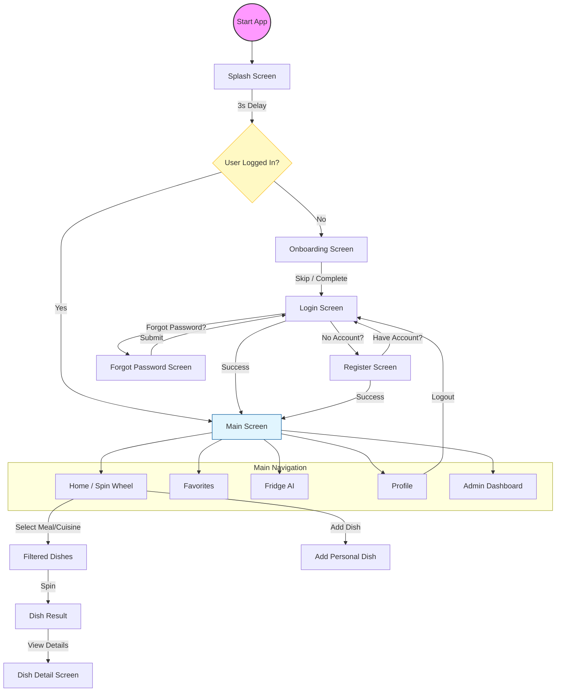
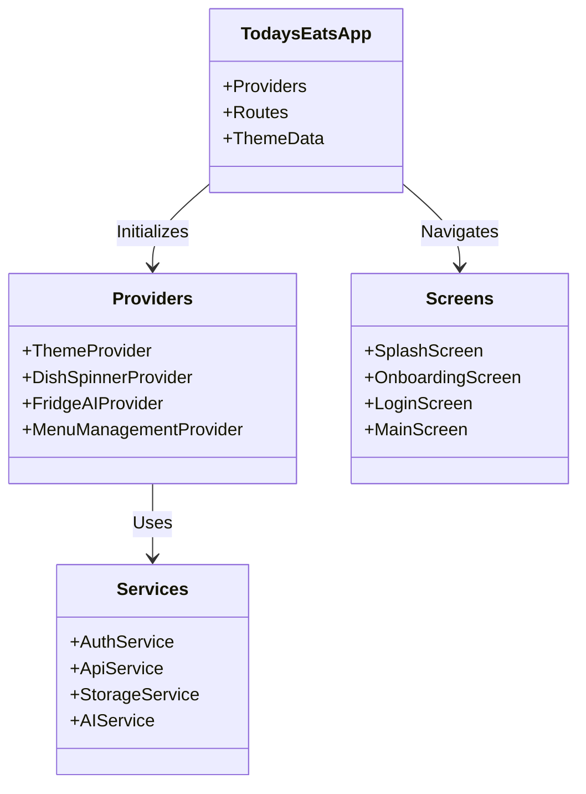

# Today's Eats - App Flowchart

This document illustrates the user flow and architecture of the **Today's Eats** application.

## 🔄 User Journey Flow

```mermaid
graph TD
    %% Nodes
    Start((Start App))
    Splash[Splash Screen]
    AuthCheck{User Logged In?}
    Onboarding[Onboarding Screen]
    Login[Login Screen]
    Register[Register Screen]
    ForgotPW[Forgot Password Screen]
    Main[Main Screen]

    %% Subgraphs for Main Tabs
    subgraph MainTabs [Main Navigation]
        direction LR
        Home[Home / Spin Wheel]
        Favorites[Favorites]
        FridgeAI[Fridge AI]
        Profile[Profile]
        Admin[Admin Dashboard]
    end

    %% Connections
    Start --> Splash
    Splash -- 3s Delay --> AuthCheck

    AuthCheck -- No --> Onboarding
    AuthCheck -- Yes --> Main

    Onboarding -- Skip / Complete --> Login

    Login -- "No Account?" --> Register
    Login -- "Forgot Password?" --> ForgotPW
    Login -- Success --> Main

    Register -- Success --> Main
    Register -- "Have Account?" --> Login

    ForgotPW -- Submit --> Login

    %% Main Navigation Logic
    Main --> Home
    Main --> Favorites
    Main --> FridgeAI
    Main --> Profile
    Main --> Admin

    %% Home Detail Flow
    Home -- Select Meal/Cuisine --> FilteredList[Filtered Dishes]
    FilteredList -- Spin --> ResultDialog[Dish Result]
    ResultDialog -- View Details --> DishDetail[Dish Detail Screen]
    Home -- Add Dish --> AddDishDialog[Add Personal Dish]

    %% Profile Actions
    Profile -- Logout --> Login

    %% Styling
    style Start fill:#f9f,stroke:#333,stroke-width:2px
    style Main fill:#e1f5fe,stroke:#01579b
    style AuthCheck fill:#fff9c4,stroke:#fbc02d
```

## 🏗️ Application Architecture

```mermaid
classDiagram
    class TodaysEatsApp {
        +Providers
        +Routes
        +ThemeData
    }

    class Providers {
        +ThemeProvider
        +DishSpinnerProvider
        +FridgeAIProvider
        +MenuManagementProvider
    }

    class Services {
        +AuthService
        +ApiService
        +StorageService
        +AIService
    }

    class Screens {
        +SplashScreen
        +OnboardingScreen
        +LoginScreen
        +MainScreen
    }

    TodaysEatsApp --> Providers : Initializes
    TodaysEatsApp --> Screens : Navigates
    Providers --> Services : Uses
```
