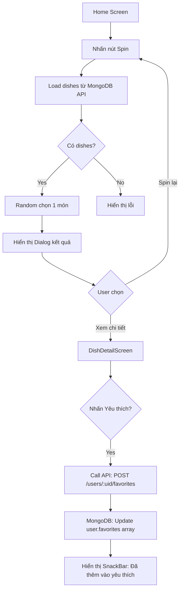

# Sơ đồ Luồng Home - Quay món (Dish Spinner) - Today's Eats

**Ngày xác nhận:** 11/12/2025  
**Trạng thái:** ⚠️ SƠ ĐỒ CÓ 1 LỖI CẦN SỬA

---

## ⚠️ **LỖI QUAN TRỌNG TRONG SƠ ĐỒ:**

| Trong Sơ đồ | Trong Code | Trạng thái |
|--------------|------------|------------|
| "Tải danh sách món (từ **Firestore** hoặc cache)" | Tải từ **MongoDB** qua API backend | ❌ **SAI!** |
| "Ghi món vào **Firestore** (favorites của user)" | Ghi vào **MongoDB** qua API | ❌ **SAI!** |

> [!IMPORTANT]
> **App KHÔNG sử dụng Firestore! Tất cả dữ liệu đều lưu trong MongoDB qua API backend.**

---

## 📊 Sơ đồ luồng ĐÚNG

```
Home Screen (Dish Spinner)
  ↓
Hiển thị nút "Spin"
  ↓
Người dùng nhấn "Spin"
  ↓
Tải danh sách món (từ MongoDB qua API backend) ✅ (SỬA)
  ↓
Random chọn 1 món ăn
  ↓
Hiển thị thông tin món: Tên, Hình ảnh, Mô tả, Nguyên liệu,...
  ↓
Người dùng lựa chọn:
  ├─ Nhấn "Thêm vào yêu thích"
  │     ↓
  │     Ghi món vào MongoDB (favorites của user) ✅ (SỬA)
  │     ↓
  │     Hiển thị thông báo "Đã thêm vào yêu thích"
  │
  └─ Nhấn "Spin lại"
        ↓
        Thực hiện quay món ngẫu nhiên lần nữa (lặp lại bước Random)
```

---

## 🔍 Chi tiết implementation

### 1. **Load danh sách món - Từ MONGODB**

**File:** [`lib/features/home/spin_home_screen.dart`](file:///home/nho/Documents/TodaysEats/lib/features/home/spin_home_screen.dart#L34-L67)

```dart
Future<void> _loadDishes() async {
  setState(() => _isLoading = true);
  try {
    // Get current user ID
    final user = FirebaseAuth.instance.currentUser;
    final userId = user?.uid ?? 'anonymous';
    
    // ✅ Gọi MongoDB API (KHÔNG phải Firestore!)
    final dishes = await _apiService.getAllDishesWithPersonal(
      userId: userId,
      limit: 50,
    );
    
    setState(() {
      _allDishes = dishes;
      _filterDishes();
      _isLoading = false;
    });
  } catch (e) {
    print('Error loading dishes: $e');
    // Fallback to regular dishes
    try {
      final dishes = await _apiService.getDishes(limit: 50);
      setState(() {
        _allDishes = dishes;
        _filterDishes();
        _isLoading = false;
      });
    } catch (e2) {
      print('Fallback also failed: $e2');
      setState(() => _isLoading = false);
    }
  }
}
```

**API Service:** [`lib/core/services/api_service.dart`](file:///home/nho/Documents/TodaysEats/lib/core/services/api_service.dart#L74-L96)

```dart
// Get global dishes + user's personal dishes
Future<List<Map<String, dynamic>>> getAllDishesWithPersonal({
  required String userId,
  int limit = 50,
}) async {
  try {
    // ✅ Gọi API MongoDB backend
    final uri = Uri.parse('$baseUrl/user-dishes/all').replace(
      queryParameters: {
        'userId': userId,
        'limit': limit.toString(),
      },
    );
    final response = await http.get(uri);

    if (response.statusCode == 200) {
      final data = json.decode(response.body);
      return List<Map<String, dynamic>>.from(data);
    } else {
      throw Exception('Failed to load dishes: ${response.statusCode}');
    }
  } catch (e) {
    throw Exception('Error fetching dishes: $e');
  }
}
```

**Backend endpoint:** `GET /api/user-dishes/all?userId={uid}&limit=50`

---

### 2. **Random chọn món**

**File:** [`lib/common_widgets/dish_spin_wheel.dart`](file:///home/nho/Documents/TodaysEats/lib/common_widgets/dish_spin_wheel.dart) (widget component)

Luồng:
1. User nhấn nút "Spin"
2. Animation quay vòng
3. Random index từ list dishes: `Random().nextInt(dishes.length)`
4. Stopped at selected dish
5. Callback `onResult(selectedDish)`

---

### 3. **Hiển thị kết quả**

**File:** [`lib/common_widgets/dish_result_dialog.dart`](file:///home/nho/Documents/TodaysEats/lib/common_widgets/dish_result_dialog.dart)

**Hiển thị:**
- ✅ Hình ảnh món (nếu có `imageUrl`)
- ✅ Tên món: `dish['name']`
- ✅ Mô tả: `dish['description']`  
- ✅ 2 nút action:
  - "Quay lại" → Spin again
  - "Xem chi tiết" → `DishDetailScreen`

**Chi tiết món - Detail Screen:**

**File:** [`lib/features/4_dish_detail/dish_detail_screen.dart`](file:///home/nho/Documents/TodaysEats/lib/features/4_dish_detail/dish_detail_screen.dart)

Hiển thị đầy đủ:
- ✅ Hình ảnh lớn
- ✅ Tên món  
- ✅ Category & Meal time (chips)
- ✅ Mô tả chi tiết
- ✅ Thời gian nấu & Số người ăn
- ✅ **Nguyên liệu** (`ingredients` list)
- ✅ **Cách làm** (`cookingInstructions` với step-by-step)
- ✅ Nút **Yêu thích** (toggle favorite)

---

### 4. **Thêm vào yêu thích - LƯU VÀO MONGODB**

**File:** [`lib/features/4_dish_detail/dish_detail_screen.dart`](file:///home/nho/Documents/TodaysEats/lib/features/4_dish_detail/dish_detail_screen.dart#L17-L64)

```dart
Future<void> _toggleFavorite() async {
  setState(() => _isTogglingFavorite = true);

  try {
    final provider = Provider.of<MenuManagementApiProvider>(context, listen: false);
    final dishId = widget.dish['_id'] ?? widget.dish['id'];
    
    // ✅ Gọi provider để toggle favorite
    await provider.toggleFavorite(dishId);

    if (mounted) {
      final isFavorite = widget.dish['isFavorite'] ?? false;
      ScaffoldMessenger.of(context).showSnackBar(
        SnackBar(
          content: Text(
            isFavorite ? 'Đã bỏ yêu thích' : 'Đã thêm vào yêu thích',
          ),
        ),
      );
    }
  } catch (e) {
    // Error handling
  } finally {
    setState(() => _isTogglingFavorite = false);
  }
}
```

**Provider:** [`lib/features/3_menu_management/menu_management_api_provider.dart`](file:///home/nho/Documents/TodaysEats/lib/features/3_menu_management/menu_management_api_provider.dart#L124-L167)

```dart
Future<void> toggleFavorite(String dishId) async {
  try {
    final user = FirebaseAuth.instance.currentUser;
    if (user == null) {
      throw Exception('Vui lòng đăng nhập');
    }

    // ✅ Gọi API MongoDB để toggle favorite
    await _apiService.toggleFavorite(user.uid, dishId);
    
    // Reload dishes để cập nhật
    await loadDishes();
  } catch (e) {
    throw Exception('Lỗi khi thêm/bỏ yêu thích: $e');
  }
}
```

**API Service:** [`lib/core/services/api_service.dart`](file:///home/nho/Documents/TodaysEats/lib/core/services/api_service.dart#L264-L282)

```dart
Future<Map<String, dynamic>> toggleFavorite(String uid, String dishId,
    {String? token}) async {
  try {
    // ✅ POST request tới MongoDB backend
    final response = await http.post(
      Uri.parse('$baseUrl/users/$uid/favorites'),
      headers: await _getHeaders(token: token),
      body: json.encode({'dishId': dishId}),
    );

    if (response.statusCode == 200) {
      return json.decode(response.body);
    } else {
      throw Exception('Failed to toggle favorite: ${response.statusCode}');
    }
  } catch (e) {
    throw Exception('Error toggling favorite: $e');
  }
}
```

**Backend endpoint:** `POST /api/users/:uid/favorites`

**Request body:**
```json
{
  "dishId": "dish_id_here"
}
```

**Response:**
```json
{
  "message": "Đã thêm vào yêu thích" // or "Đã bỏ yêu thích",
  "isFavorite": true,
  "favorites": ["dish1", "dish2", ...]
}
```

**MongoDB collection:** `users`

**Document structure:**
```json
{
  "_id": "user_uid",
  "email": "user@example.com",
  "displayName": "User Name",
  "favorites": [  // ✅ Lưu ở đây!
    "dish_id_1",
    "dish_id_2",
    "dish_id_3"
  ],
  ...
}
```

---

## 📋 Workflow đầy đủ



---

## 🗂️ Database Architecture

### Firebase Auth (Authentication only)
- ✅ User authentication (email/password, Google)
- ✅ User UID
- ❌ **KHÔNG** lưu favorites
- ❌ **KHÔNG** lưu dishes

### MongoDB (All data)
**Users Collection:**
```json
{
  "_id": "firebase_uid",
  "email": "user@example.com",
  "displayName": "User Name",
  "photoURL": "...",
  "favorites": ["dish_id_1", "dish_id_2"],  // ✅ Favorites ở đây
  "createdAt": "2025-12-11T...",
  "updatedAt": "2025-12-11T..."
}
```

**Dishes Collection:**
```json
{
  "_id": "dish_id",
  "name": "Phở Bò",
  "description": "...",
  "category": "Vietnamese",
  "mealType": "breakfast",
  "tags": ["việt nam", "phở"],
  "ingredients": ["...", "..."],
  "cookingInstructions": [...],
  "imageUrl": "...",
  "createdAt": "...",
  ...
}
```

---

## ✅ Xác nhận tổng hợp

| Thành phần trong Sơ đồ | Implementation | Trạng thái |
|------------------------|----------------|------------|
| Home Screen (Dish Spinner) | ✅ `spin_home_screen.dart` | ✅ ĐÚNG |
| Hiển thị nút "Spin" | ✅ `DishSpinWheel` widget | ✅ ĐÚNG |
| Người dùng nhấn "Spin" | ✅ onPressed callback | ✅ ĐÚNG |
| **Tải danh sách món từ Firestore** | ❌ Tải từ **MongoDB** qua API | ❌ **SAI!** |
| Random chọn 1 món | ✅ `Random().nextInt()` | ✅ ĐÚNG |
| Hiển thị thông tin món | ✅ `DishResultDialog` + `DishDetailScreen` | ✅ ĐÚNG |
| Nhấn "Thêm vào yêu thích" | ✅ `_toggleFavorite()` | ✅ ĐÚNG |
| **Ghi món vào Firestore** | ❌ Ghi vào **MongoDB** qua API | ❌ **SAI!** |
| Hiển thị thông báo | ✅ SnackBar | ✅ ĐÚNG |
| Nhấn "Spin lại" | ✅ Close dialog + spin again | ✅ ĐÚNG |

---

## 🎯 Kết luận

> [!WARNING]
> **Sơ đồ sai ở 2 chỗ:**
> 1. "Tải danh sách món (từ **Firestore** hoặc cache)" → Phải là **MongoDB**
> 2. "Ghi món vào **Firestore**" → Phải là **MongoDB**

**Sơ đồ đúng phải là:**
```
1. Tải danh sách món từ MongoDB (qua API backend) ✅
2. Ghi món vào MongoDB (favorites trong user document) ✅
```

**App architecture:**
- **Firebase:** Chỉ dùng cho Authentication
- **MongoDB:** Lưu TẤT CẢ dữ liệu (users, dishes, favorites, etc.)
- **Backend API:** Node.js/Express server kết nối MongoDB
- **Flutter App:** Gọi API để CRUD data

**Không có Firestore trong project này!** ❌

---

## 📝 Workflow Favorites chi tiết

### Add to Favorites
```
1. User nhấn nút ❤️ "Yêu thích"
   ↓
2. Flutter call: provider.toggleFavorite(dishId)
   ↓
3. Provider call: _apiService.toggleFavorite(uid, dishId)
   ↓
4. API Service: POST /api/users/{uid}/favorites
   ↓
5. Backend (Node.js):
   - Tìm user trong MongoDB by uid
   - Check dishId có trong favorites[]?
     - Có → Remove (bỏ yêu thích)
     - Không → Add (thêm yêu thích)
   - Update document
   ↓
6. Response về app
   ↓
7. Provider reload dishes
   ↓
8. UI cập nhật icon ❤️
   ↓
9. SnackBar: "Đã thêm vào yêu thích"
```

**MongoDB operation:**
```js
// Backend code (Node.js)
if (user.favorites.includes(dishId)) {
  // Remove from favorites
  await User.updateOne(
    { uid: userId },
    { $pull: { favorites: dishId } }
  );
} else {
  // Add to favorites
  await User.updateOne(
    { uid: userId },
    { $addToSet: { favorites: dishId } }
  );
}
```

**Luồng hoàn toàn đúng, CHỈ CẦN SỬA "Firestore" → "MongoDB"!** ✅
